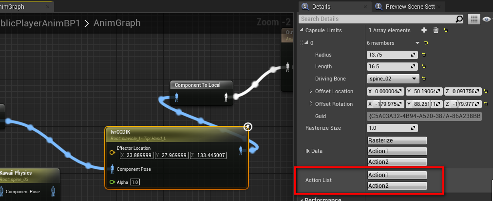

# CustomPropertyAction
UE4, CustomDetailPanel, Struct Function CallInEditor.

### 环境

UE4.26

### 说明

默认的UE4，不支持在Struct中定义UFUNCTION(CallInEditor)。

扩展UE4，自定义Details面板，以便支持UFUNCTION(CallInEditor)

### 用法

```
// .h
USTRUCT()
struct CUSTOMPROPERTYACTION_API FCustomPropertyActionTest
{
	GENERATED_USTRUCT_BODY()

    FCustomPropertyActionTest();

	// 声明
	UPROPERTY(EditAnywhere)
		FCustomPropertyAction ActionList;

	void OnClick(const FString& Action);
};


// .cpp
FCustomPropertyActionTest::FCustomPropertyActionTest()
{
	ActionList.OnNotify = FCustomPropertyAction::FOnClick::CreateRaw(this, &FCustomPropertyActionTest::OnClick);
	ActionList.ActionList.Add(TEXT("Action1"));
	ActionList.ActionList.Add(TEXT("Action2"));
}

void FCustomPropertyActionTest::OnClick(const FString& Action)
{
    
}

```

### 效果图

